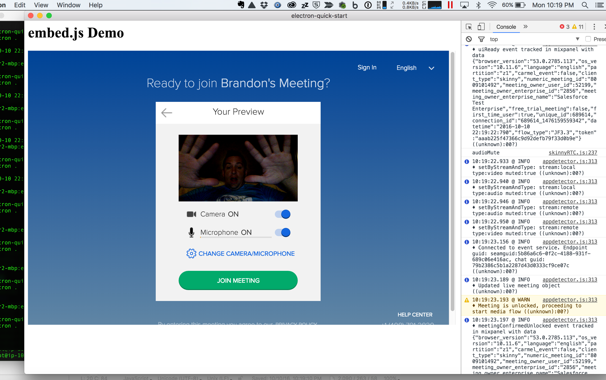

# Electron as a Container

[Electron](https://electron.atom.io/) is an exciting way to build cross platform desktop apps with JavaScript, HTML, and CSS.  Allowing the traditional web developer to cross over into desktop app development without learning completely new languages and frameworks.

Nearly since the inception of the web browser, vendors relied on plugins when things needed to be done in a browser that the browser couldn't do through built-in technologies.  Audio and video support were a few of these things.

However, with the advent of WebRTC, browsers are getting audio and video technologies baked into their core and expose through JavaScript interfaces that can be used by web applications.

Electron itself contains the Chromium browser (the foundation of Google Chrome).  Since 2016, WebRTC has been included as well.

This makes it possible to build a desktop app via Electron where the application has audio and video capabilities.

BlueJeans has embraced WebRTC supports it across a variety of browsers, including Google Chrome and inside Electron.

You can now embed a video conference from BlueJeans via a simple HTML IFRAME and experience our meetings within your Electron app.

## Screen Sharing

Electron provides APIs for screen sharing.  Some JavaScript has to be added to the container in order to facilitate this with BlueJeans.  That code exists in this GitHub repo.
